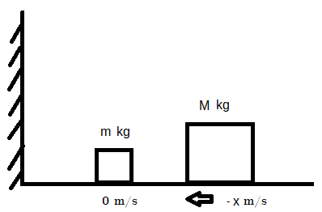
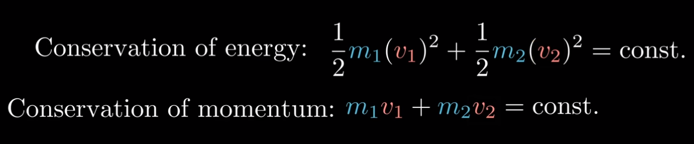

##### Collisions

Consider the following arrangement of square-shaped bodies:

Perform a simulation of what will happen.

To give you a rough idea, typically the object `M` (larger mass) would hit `m` (smaller mass), which in turn would bounce of the wall and hit `M`, bouncing again, etc.

 Consider the object/object and object/wall collisions to be perfectly [elastic](https://en.wikipedia.org/wiki/Elastic_collision).

Consider the floor to be frictionless. Also, consider that the bodies never leave contact with the floor (in other words, work on a single dimension).

Eventually the situation will be such that `M` veers to the right faster than than `m`, so they'll never collide again. Stop your simulation at that point.

Start with a low ratio between `M` and `m` to analyze what is happening and help you nail your simulation down (i.e., the right-hand body has a slightly larger mass than the left-hand one). When you are confident with it, try increasing this ratio. Do you notice anything odd about this number?

As for the initial velocity `x` of `M`, consider it kind of arbitrary; just don't go crazy with it and give a sensible value. `-5/ms` is a good starting point.

You might want to read up a little on the equations for conservation of energy and conservation of momentum. Here they are for reference:

 
