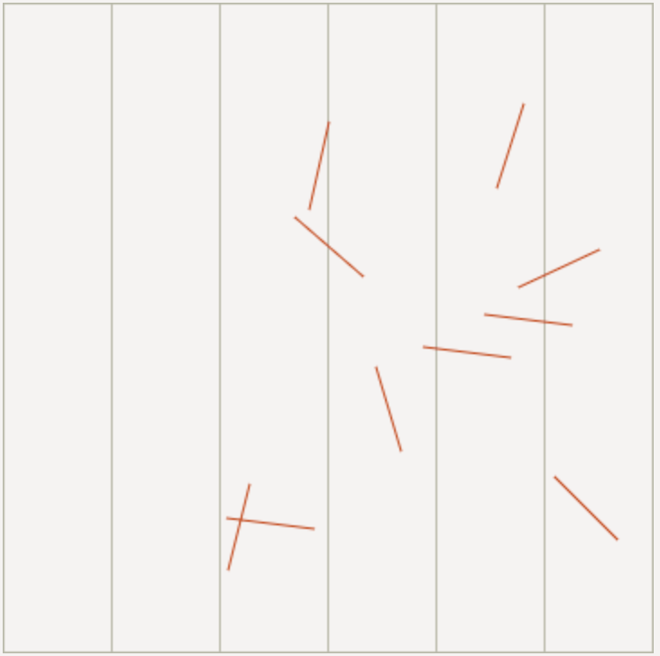
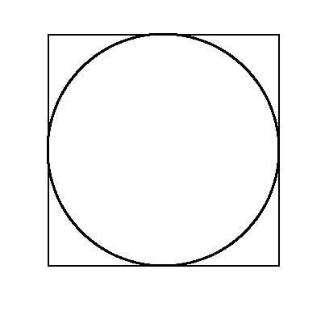

##### Toothpicks

Toss a number of toothpicks upon a floor made of wooden planks. Find the probability that a toothpick intersects any joint line between the planks.

Consider the length of a toothpick to be lower than the width of a plank.

Consider the joint line to have no thickness.

##### Darts

If you find the above problem troublesome (there's a bit of math involved), here's a much simpler version: what's the probability of a dart to hit a dart board?

Consider the darts to hit randomly within a square whose side equals the diameter of the dart board.

##### Ratio

For a high enough number of either toothpicks or darts, what does the ratio between hits and misses look like?
